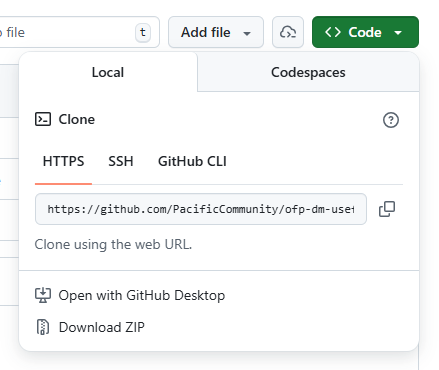

# ofp-dm-useful-scripts

This is a **public repository** created for maintaining useful scripts
that can be reused by various stakeholders. Remember that this is a
**public repository**, do not store any sensitive information here.

If you have a script you would like to add to this repo, please make
sure you create a new folder and include a .README to describe what the
scripts are doing and the audience who would benefit from it.

This is a protected repository, all new additions to it will require a
Pull Request and someone from SPC to approve it.

**If you are a GitHub beginner** and its is your first time working and
cloning a GitHub repository, follow the steps below.

[In this repository](https://github.com/PacificCommunity/ofp-sam-git-workshop/tree/main)
you will find all the material presented in the *SPC Git and Github workshop*, a valuable resource
in case you want to learn more about these powerful tools.

## How to Clone a GitHub Repository

This guide will walk you through cloning (downloading) a GitHub
repository to your computer, even if you've never done it before.

*Cloning a repository* means downloading a complete copy of the project
files from GitHub to your local computer so you can view, edit, or run
them.

### Prerequisites

Before you start, you'll need to install Git on your computer.

- **Windows:** [git-scm.com](https://git-scm.com/download/win)

- **Linux:** Open Terminal and run

    `sudo apt-get install git` 

### Steps to Clone a Repository

#### Step 1: Find the Repository URL

1.  Click on the green **Code** button near the top right of this page
2.  Copy the HTTPS URL shown (it should look like
    `https://github.com/PacificCommunity/ofp-dm-useful-scripts.git`)

    

You can also use an SSH key, but for that you will need to make sure you have one and that you added it to GitHub. For more info on how to that, go to: [Generating a new SSH key and adding it to the ssh-agent](https://docs.github.com/en/authentication/connecting-to-github-with-ssh/generating-a-new-ssh-key-and-adding-it-to-the-ssh-agent)

#### Step 2: Open Your Terminal or Command Prompt (Windows)

Press `Win + R`, type `cmd`, and press Enter - Or search for "Command Prompt" in the Start menu

#### Step 3: Navigate to Where You Want the Repository

Before cloning, decide where you want to save the repository on your
computer (it is like choosing where you want to create a new folder).
Use the `cd` (change directory) command:

``` bash
cd Documents
```

The code above means that you are entering inside your `Documents`
folder. In this step you need to navigate until the directory in your
computer where you want to clone ("download") all the files available in
this repository.

You can also create a new folder and navigate to it:

``` bash
mkdir Projects
cd Projects
```

#### Step 4: Clone the Repository

Once you are in the path you want to clone this repo (step above), you
can type the following command (the URL you copied):

``` bash
git clone https://github.com/PacificCommunity/ofp-dm-useful-scripts.git
```

Press Enter and wait for the download to complete. You'll see progress
messages as Git downloads the files.

#### Step 5: Access Your Cloned Repository

Once cloning is complete, navigate into the repository folder:

``` bash
cd repository-name
```

Now that you've cloned the repository, you can:

-   Open the files in your favorite code editor
-   Follow any setup instructions in the project's README
-   Make changes and learn about committing and pushing changes back to
    GitHub
    
## Troubleshooting

**"git is not recognized"** or **"command not found"** - Git isn't
installed or isn't in your system PATH. Reinstall Git and make sure to
select the option to add it to your PATH during installation.

**"Repository not found"** - Double-check the URL you copied. Make sure
it's correct and the repository is public (or you have access if it's
private).
